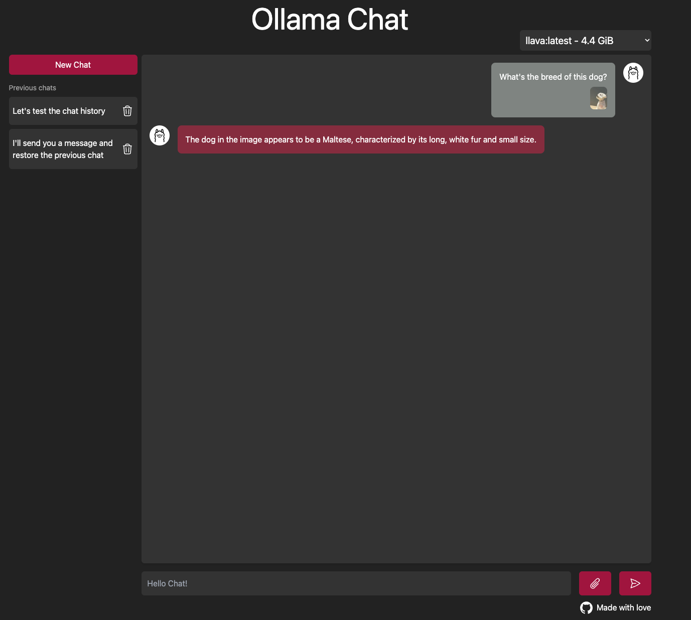

# Ollama Chat

Viusal Ollama chat supporting images for multimodal LLMs such as LLava.

## Running the project

By default Ollama Chat uses the llava model, therefore before running the chat
you should pull llava model:

```bash
ollama pull llava
```

Once you have llava downloaded you can run the chat application:

```bash
npm install & npm run dev
```

## Screenshot


